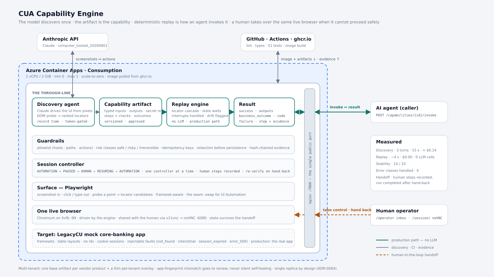

# CUA Capability Engine

> The model discovers once. The artifact becomes a reusable capability. Deterministic replay is how the agent invokes it.

**Live demo:** https://cua-demo.greenground-c99e6748.eastus.azurecontainerapps.io — landing page with the mock bank, the capability
catalog, and the operator console with noVNC takeover (cold start ≈ 30–60 s; the app scales to zero when idle).
**Design write-up:** [REPORT.md](REPORT.md) · **Decision records:** [docs/adr/](docs/adr/) · **Evidence:** [evidence/](evidence/)

| Discovery (one real LLM run) | Replay (production path) | Stability | Exceptional states | Human handoff |
|---|---|---|---|---|
| 3 turns · 3 API calls · 11,395 / 531 tokens · 15 s · ≈ $0.14 | ~4 s · $0.00 · **0 LLM calls** | 10 / 10 | not-found · interstitial · session expiry · transient 500 | took over the live browser, 4 actions recorded, run completed |

---

## 1. The problem this solves

Banks and credit unions run a long tail of back-office applications with no API: server-rendered screens, framesets,
table layouts, nothing an automation tool would call stable. An AI agent that has to *operate* those screens cannot
afford to re-reason about the UI on every call — it is slow, expensive, and non-deterministic in a regulated setting.

This system splits the problem in two:

1. **Discovery** — a model (Claude, computer use) drives the application *once* from screenshots to accomplish a goal
   stated in natural language, while the system records what it did and how each control was identified.
2. **Replay** — the recording is emitted as a typed, versioned **capability artifact** that an agent can invoke with
   parameters, and that replays **without any model in the loop**, verifying every step, recovering from the runtime
   conditions that legitimately occur (session expiry, interstitials, transient errors), returning business outcomes
   as data rather than crashes, and escalating to a human who takes over the **same live browser** when it cannot
   proceed safely.

---

## 2. Architecture



Everything runs in **one container** (single process, single replica — a deliberate decision, [ADR-0004](docs/adr/0004-single-process-single-replica.md)):

| Layer | What it does | Where |
|---|---|---|
| **nginx** | The only public port. Routes the API, the mock bank and the operator console to FastAPI, and `/session/` to noVNC. | `deploy/nginx.conf` |
| **Discovery agent** | Observe → decide → act loop on Anthropic's GA `computer_toolset_20260801`. Screenshots in, coordinates out. Runs batched actions, prunes old screenshots for cache efficiency, and probes the DOM under every click to derive *ranked* locator candidates. Token-gated in the hosted deployment. | `src/cua/agent/` |
| **Capability artifact** | The contract: typed inputs (with sensitivity), secret *references*, typed outputs with transforms, ordered steps with ranked locators and per-step postconditions, interrupts, business outcomes, a success checkpoint, approval state, stability score, provenance, tenant overlays. Pydantic v2, JSON on disk, JSON Schema exported. | `src/cua/artifact/schema.py` |
| **Replay engine** | Executes an artifact with **no LLM**: resolves locators through the candidate cascade, waits on state (never sleeps), checks interrupt and outcome detectors before each step and again when a postcondition fails, restarts the flow once after re-login, enforces idempotency keys, emits drift proposals instead of self-healing silently. | `src/cua/replay/engine.py` |
| **Guardrails** | YAML allowlist (hosts, paths, action types), risk classes `safe / risky / irreversible`, redaction of secrets and PII before anything is persisted, hash-chained evidence. Every action in discovery *and* replay passes the policy gate. | `src/cua/policy/`, `src/cua/evidence/` |
| **Session controller** | The control-transfer model: `AUTOMATION → PAUSED → HUMAN → RESUMING → AUTOMATION`, exactly one controller at a time, every transition an evidence event, human actions captured from every frame, re-verification on hand-back. | `src/cua/escalation/session.py` |
| **Surface** | The seam for heterogeneity. `observe / act / probe / resolve` over Playwright today; a typed `DesktopSurface` stub maps the same interface to Windows UI Automation. Nothing above this layer references a browser. | `src/cua/surface/` |
| **One live browser** | Chromium, headed, on Xvfb; shared with the human through x11vnc → noVNC. The engine and the operator act on the same session, so cookies and page state survive the handoff. | `Dockerfile`, `deploy/supervisord.conf` |
| **Target app** | "LegacyCU", a deliberately hostile mock core-banking app: framesets, table layouts, no ids, cookie sessions, synthetic data, a second tenant, and six injectable faults that fire once per session like their real counterparts. | `mockbank/` |

### How a request moves through it

**Discovery** (once per capability): `cua discover` → the agent logs in with credentials passed in the prompt (never on the
page) → each action is policy-checked, executed, and probed → a `finish` tool call reports the extracted values → the
recorder parameterises the run (`${inputs.member_id}`, `${secrets.password}`), derives postconditions from frame-level
URL deltas, and writes `evidence/capabilities/<id>@<version>.json` plus a hash-chained evidence folder.

**Replay** (every production call): `POST /capabilities/{id}/invoke` → policy and approval gate → for each step:
interrupts → outcomes → precondition → resolve → policy → act → postcondition → success checkpoint → typed outputs.
Result is one of `success | business_outcome | failure | escalated`, with `recoveries[]` and `drift_proposals[]`.

**Escalation** (when replay cannot proceed): the engine pauses, writes an intervention request (capability, step, reason,
screenshot, current URL, whether the browser is headed) and waits. The operator takes control from the inbox, acts in
the live browser, and hands back. The engine re-verifies: step completed → continue; target now visible → rerun the
step; otherwise → re-run the flow once from the entry page. Every human click is in the evidence as a `human_step`.

---

## 3. How I approached it

The brief said the artifact schema, error handling and the control-transfer model were the load-bearing pieces, and that
judgment mattered more than breadth. That set the order of work:

1. **Decide before coding.** I wrote the schema and six decision records before the loop existed: pixels-first
   discovery with DOM-probed locators ([ADR-0001](docs/adr/0001-pixels-first-discovery-dom-probe-locators.md)), a local
   hostile mock instead of a public site ([ADR-0003](docs/adr/0003-local-hostile-mock-app.md)), single process, the
   guardrail model, the handoff state machine. Each one names the trade-off and what was rejected.
2. **Build the target first.** A mock that can *cause* every error class on demand is what makes the error-handling
   evidence possible. Public demo sites cannot expire your session when you ask them to.
3. **Shake out the surface without a model.** A scripted run through the frameset — every locator strategy, the probe,
   extraction, a fault — cost nothing and caught a coordinate bug before a single token was spent.
4. **Get the real discovery run early.** It is the one thing the brief said could not be mocked. It succeeded on the
   first attempt (3 turns), which meant the rest of the time could go into what happens *after* discovery.
5. **Make the recorder correct through tests, not runs.** Three recorder bugs — credentials landing in the artifact, a
   literal balance baked into a locator, and a stray click that should have merged into the following type — were all
   caught by a browser-free unit test against a synthetic transcript, and fixed before re-recording.
6. **Prove the engine's control flow against a fake surface.** The replay engine is tested against a scripted state
   machine, not a browser: interrupt after a step, business outcome on postcondition failure, session expiry restart,
   escalation with a human completing the step, and hand-back from the wrong screen. That suite found a deadlock in
   the handoff (the engine was waiting on an event only the engine could set) before any human ever tried it.
7. **Then the live exceptional-state runs, then hosting, then the write-up.**

Things that went wrong and shaped the design: the first replay took 52 s because a frameset document has no `<body>`
and every text read waited 1.5 s for one (now `evaluate`, instant); the first human takeover recorded nothing because
the page script was an arrow function that was never invoked (now an IIFE with a `sessionStorage` queue that survives
navigations); the first hand-back demanded the operator leave the screen in exactly the right state (now the engine
re-verifies, reruns, or restarts the flow). Each of those is a test now.

---

## 4. Workflow

```
discover ──► review & approve ──► replay (unattended) ──► success / business_outcome
                                        │
                                        └──► stuck ──► intervention request ──► human takes the live browser ──► hand back ──► resume
```

- **Discover:** `cua discover --goal "..." --entry URL --param member_id=10023 --name lookup_member_balance`
- **Review:** `cua describe <artifact>` prints the contract; `cua validate` checks it; `cua approve` moves it to `approved`
  (unattended replay is refused for anything else).
- **Replay:** `cua replay <artifact> --param member_id=10041 [--fault ...] [--attended] [--dry-run]`, or over HTTP.
- **Measure:** `cua stability <artifact> --n 10` writes a flakiness score into the artifact.
- **Verify evidence:** `cua evidence verify evidence/` recomputes every hash chain; `cua evidence leak-check evidence/`
  asserts no secret or PII literal appears anywhere.

The HTTP surface is what an agent product would use: `GET /capabilities` (catalog), `GET /capabilities/{id}`
(description + JSON Schema for the arguments), `POST /capabilities/{id}/invoke`, and the operator endpoints.

---

## 5. Outcomes

| Run | What it shows | Result |
|---|---|---|
| `evidence/discovery-…1b4d25` | the real LLM-driven run that produced the artifact | 3 turns, 15 s |
| `evidence/replay-…103c62` | deterministic replay, typed output, 0 LLM calls | `success`, 3.9 s |
| `evidence/replay-…0efca1` | member does not exist | `business_outcome MEMBER_NOT_FOUND`, 3.7 s |
| `evidence/replay-…aa2bd3` | interstitial notice appears after the search | `success`, recovered by the engine, 4.4 s |
| `evidence/replay-…392b82` | session expires mid-flow | `success`, re-login and flow restarted once, 6.0 s |
| `evidence/replay-…7ada1c` | member screen returns a transient 500 | escalated → human took control → 4 `human_step`s → resumed → `success` |

Ten consecutive replays succeeded (stability 10/10, ~3.8 s each). Every `events.jsonl` verifies, and the leak check is
clean against the real secret values. The same replay and the same human takeover work on the hosted deployment, over
noVNC, with no desktop involved.

---

## 6. Cloud services and tooling

| Service | Role | Cost |
|---|---|---|
| **Anthropic API** — `claude-fable-5`, `computer_toolset_20260801` | Discovery only. Never called by replay. | ≈ $0.14 per recorded capability |
| **Azure Container Apps** (Consumption, East US) | Hosts the single container: 1 vCPU / 2 GiB, min 0 / max 1 replicas, external ingress on 7860 | inside the monthly free grant; $0 when idle |
| **Azure Log Analytics** | created automatically by the Container Apps environment for logs | free tier |
| **GitHub Actions** | `ci`: ruff, mypy --strict, 47 unit tests, 4 live browser replays, gitleaks. `build-and-deploy`: builds the image and pushes it to ghcr.io on every push to `main`. `discovery-run`: manual, spends tokens, commits fresh evidence. | free for public repos |
| **GitHub Container Registry** | `ghcr.io/suriya-002/cua-capability-engine:<sha>` — Container Apps pulls it directly | free |
| **Playwright 1.63 + Chromium** | the web `Surface`; headed on Xvfb in the container | — |
| **Xvfb · x11vnc · noVNC · nginx · supervisord** | the display stack that lets a human take over the engine's browser from a web page | — |
| Python 3.11+, FastAPI, Pydantic v2, Typer, structlog | application stack | — |

Deploying is two steps: CI publishes the image; `deploy/azure/deploy.ps1` (or `az containerapp update --image …:<sha>`)
rolls it out. Secrets (`ANTHROPIC_API_KEY`, the mock's login) are Container Apps secrets injected as environment
variables and never appear in the image, the artifact, or the evidence.

---

## 7. Setup and run

```bash
git clone https://github.com/Suriya-002/cua-capability-engine && cd cua-capability-engine
python -m venv .venv && . .venv/bin/activate          # PowerShell: .\.venv\Scripts\Activate.ps1
pip install -e ".[dev]" && playwright install chromium && pre-commit install
cp .env.example .env                                  # ANTHROPIC_API_KEY for discovery only; CUA_SECRET_* is the mock's login
```

Everything except `cua discover` works with **no API key and no network**: the CLI starts the local mock bank + engine
service itself when nothing is listening on `:7860`. Quality gate: `ruff check . ; mypy ; pytest -m "not live" -q`
(47 tests, no browser) and `pytest -m live -q -k "not discovery"` (4 real replays, ~30 s).

## 8. Demo path

```bash
# 1. One real LLM-driven discovery run → evidence/discovery-<id>/ + evidence/capabilities/lookup_member_balance@1.0.0.json
cua discover --goal "Look up member 10023 and read their savings balance" \
             --entry http://localhost:7860/bank/login --param member_id=10023 --name lookup_member_balance

# 2. Review and approve (unattended replay is gated on approval)
cua describe evidence/capabilities/lookup_member_balance@1.0.0.json
cua approve  evidence/capabilities/lookup_member_balance@1.0.0.json

# 3. Deterministic replay — no LLM
cua replay evidence/capabilities/lookup_member_balance@1.0.0.json --param member_id=10041

# 4. Exceptional states
cua replay ... --param member_id=99999 --fault not_found       # business_outcome MEMBER_NOT_FOUND
cua replay ... --fault interstitial                            # success, recoveries=[notice_interstitial]
cua replay ... --fault session_expired                         # success, flow restarted once after re-login

# 5. Escalation with a human: the member screen 500s; open http://localhost:7860/operator,
#    Take control → do the search in the engine's Chromium window → Hand back
cua replay ... --fault error_500 --attended

# 6. Stability, integrity, leak check
cua stability evidence/capabilities/lookup_member_balance@1.0.0.json --n 10 --param member_id=10041
cua evidence verify evidence/ && cua evidence leak-check evidence/
```

Over HTTP against the live deployment (replace `member_id` to taste):

```bash
BASE=https://cua-demo.greenground-c99e6748.eastus.azurecontainerapps.io
curl -s -X POST $BASE/capabilities/lookup_member_balance/invoke -H "content-type: application/json" \
     -d '{"inputs":{"member_id":"10041"}}'
```

---

## 9. Repository layout

```
src/cua/
  artifact/     schema (the contract), store, JSON Schema export
  agent/        discovery loop (GA toolset shape), prompts, recorder
  replay/       deterministic engine, result contract, idempotency, drift
  policy/       allowlist + risk classes, redaction
  escalation/   control-transfer state machine, intervention requests
  evidence/     hash-chained JSONL, screenshots, failure snapshots
  surface/      Surface protocol, PlaywrightSurface, DesktopSurface stub
  api/          catalog, invoke, gated discovery, operator inbox, landing page, local server auto-start
  cli.py        discover · replay · stability · validate · describe · approve · evidence
mockbank/       the hostile legacy target with fault injection and tenant B
policies/       default.yaml — the allowlist and risk rules
evidence/       committed runs and the capability artifact
tests/          47 unit tests (schema, policy, redaction, evidence chain, session machine, recorder,
                engine control flow on a fake surface, mock bank) + live browser replays
deploy/         nginx, supervisord, Azure deploy script
docs/           architecture diagram, ADR-0001 … 0006, build plan
.github/        ci · build-and-deploy · discovery-run workflows
```

## 10. What is mocked, deliberately

The operator console is a single page (inbox + noVNC frame) rather than a product — the handoff *mechanism* underneath
is real and tested. The desktop surface is a typed stub with the UI Automation mapping in its docstring. Multi-tenant
reuse is a schema-level overlay, not a service. Cuts and next steps are in [REPORT.md §7](REPORT.md#7-cuts).
